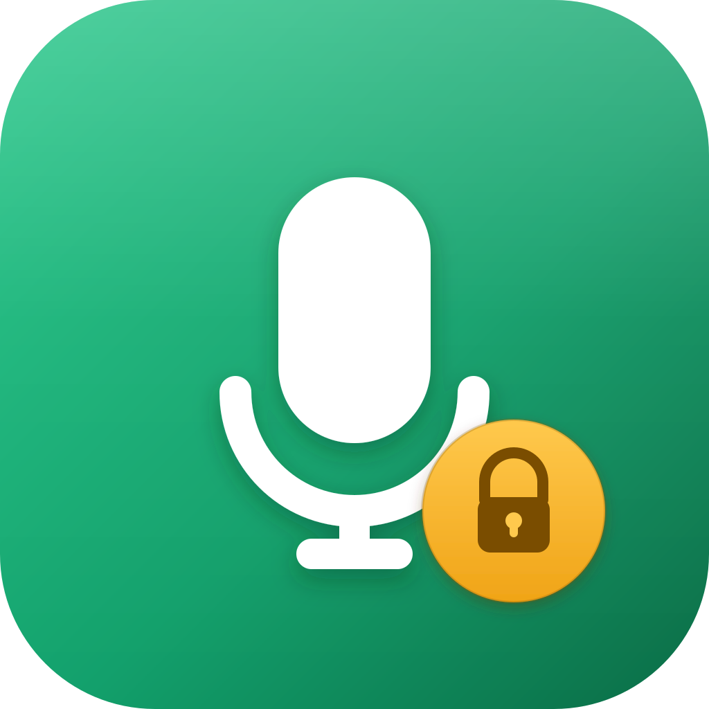

# StayMic



[](https://github.com/2nm-studio/staymic/actions/workflows/build.yml)
[](https://github.com/2nm-studio/staymic/releases)
[](#installation)
[](#build-from-source)
[](LICENSE)

**A native, event-driven macOS menu bar utility that keeps your microphone and input volume where you want them.**

macOS and the apps running on it are surprisingly happy to change your
microphone settings without asking: Google Meet or Zoom nudge your
input gain, macOS switches your default input to a Bluetooth headset
the moment it connects, a USB microphone that reconnects comes back at
whatever volume the OS feels like. StayMic sits in the menu bar,
watches CoreAudio for exactly those changes, and puts things back the
way you set them — the instant they happen, not on the next poll.

## Features

- **Every input device, one place.** StayMic lists every microphone
  CoreAudio knows about — built-in, USB, Bluetooth, virtual — with its
  live input volume, from the menu bar.
- **Input volume control.** Adjust any microphone's input volume with
  a native slider, right from the menu, without opening System
  Settings.
- **Volume locking.** Pin a microphone's input volume. If anything
  else changes it — an app, another user, System Settings — StayMic
  restores it the moment CoreAudio reports the change.
- **Default microphone selection.** Pick which microphone macOS should
  treat as the system input, from the menu.
- **Microphone locking ("Keep as Microphone").** Pin a specific device
  as the system default input. If macOS or another app switches away
  from it, StayMic switches back immediately.
- **Reconnect restoration.** Unplug a locked microphone and StayMic
  remembers it (by its persistent CoreAudio UID) and shows it as
  disconnected. Plug it back in and StayMic restores it as the default
  input and/or its locked volume, automatically.
- **Fully event-driven.** No timers, no polling loops, anywhere in the
  core logic — see [Event-driven architecture](#event-driven-architecture).
- **Launch at Login**, via the modern `SMAppService` API.

Volume locking and microphone locking are **independent** — lock
either one, both, or neither, per device.

## Screenshot

<!--
  TODO: add a real screenshot of the StayMic menu once the UI is
  final. Not included yet — this project doesn't ship placeholder or
  fake screenshots pretending to be the finished app.
-->

## Why StayMic?

> Google Meet changes your input gain.
> macOS switches to your AirPods microphone.
> A USB microphone reconnects at a different volume.
>
> StayMic listens for those changes and restores the state you chose.

macOS exposes per-device input volume and a system default input
device, but nothing to *protect* either choice. StayMic is the missing
piece: two small, independent locks, enforced the instant CoreAudio
reports a change.

## Event-driven architecture

**StayMic does not periodically poll your microphone settings.** There
is no timer anywhere in its core logic checking "did the volume
change yet?" Instead, it registers CoreAudio property listeners for:

- input volume changes, per device (`kAudioDevicePropertyVolumeScalar`)
- the system default input device (`kAudioHardwarePropertyDefaultInputDevice`)
- the device list, i.e. connects/disconnects (`kAudioHardwarePropertyDevices`)

and only does work when CoreAudio calls one of those listeners back.
At idle, with nothing changing, StayMic does nothing — no CPU spent
checking state that hasn't changed. See
[Architecture](#architecture) for how that's wired together.

## Installation

### From a GitHub Release

1. Download the latest `StayMic-vX.Y.Z-macOS.zip` from the
   [Releases page](https://github.com/2nm-studio/staymic/releases).
2. Unzip it and move `StayMic.app` to `/Applications`.
3. Open it. Release builds are currently **not signed with an Apple
   Developer ID or notarized** (see [Limitations](#limitations)), so
   macOS Gatekeeper will refuse to open it with a plain double-click.
   Instead, right-click `StayMic.app` → **Open** → **Open** in the
   dialog. You only need to do this once.
4. Look for the microphone icon in your menu bar.

### Build from source

Requirements:

- macOS 14 (Sonoma) or later
- Xcode 16 or later
- [XcodeGen](https://github.com/yonaskolb/XcodeGen) (`brew install xcodegen`)

```bash
git clone https://github.com/2nm-studio/staymic.git
cd staymic
xcodegen generate
open StayMic.xcodeproj
```

Build and run the `StayMic` scheme (⌘R). See
[CONTRIBUTING.md](CONTRIBUTING.md) for the full contributor workflow.

## Architecture

```text
CoreAudio (AudioObject property listeners)
    │
    ├── input volume changed  ──────►  VolumeLockController
    ├── default input changed ──────►  InputDeviceLockController
    └── device list changed   ──────►  AudioDeviceMonitor
                                              │
                                              ▼
                                     [AudioInputDevice] (SwiftUI state)
                                              │
                                              ▼
                                   MenuBarView / MicrophoneRow
```

- **`CoreAudioManager`** — stateless wrapper around the
  `AudioObjectGetPropertyData`/`SetPropertyData` calls: enumerate
  devices, read/write input volume (master or per-channel), read/write
  the default input device.
- **`CoreAudioPropertyListener`** — a small wrapper around
  `AudioObjectAddPropertyListenerBlock`/`RemovePropertyListenerBlock`
  that keeps the exact block reference needed to unregister cleanly.
- **`AudioDeviceMonitor`** — owns the system-level listeners, rebuilds
  the published device list on every relevant event, and resolves
  reconnects by persistent device UID.
- **`VolumeLockController`** / **`InputDeviceLockController`** — pure
  decision logic: given an observed value and a persisted target,
  decide whether to restore it. They never touch CoreAudio directly.
- **SwiftUI** (`MenuBarView`, `MicrophoneRow`, `SettingsView`) renders
  whatever `AudioDeviceMonitor` publishes.

Writes StayMic itself performs (e.g. restoring a locked volume) also
generate CoreAudio property-changed events. Rather than a reentrancy
flag, each controller compares the observed value against its target
within a small tolerance before writing — a value that's already
correct, including one StayMic just wrote, triggers no further write.

## Privacy

- StayMic does not record audio.
- StayMic does not process or transmit audio.
- StayMic does not collect analytics or telemetry.
- Microphone audio never leaves your machine — in fact, it never
  reaches StayMic at all. StayMic only reads and writes CoreAudio
  *device properties* (volume, default device), which is why it does
  not need or request microphone recording (TCC) permission.

## Limitations

- Some audio devices (particularly certain USB and Bluetooth
  microphones) don't expose a software-writable input volume control
  to CoreAudio at all. StayMic detects this and shows the device
  without a slider rather than pretending to control it.
- Release builds are currently unsigned/ad-hoc and not notarized —
  see [Installation](#installation). Contributions adding Developer ID
  signing and notarization to the release workflow are welcome; see
  the note in [`.github/workflows/release.yml`](.github/workflows/release.yml).

## Icon

The app icon is designed as vector source at
[`icon/StayMic-icon.svg`](icon/StayMic-icon.svg), with rendered
[PNG](icon/StayMic-icon.png) and [JPG](icon/StayMic-icon.jpg) variants
alongside it. The actual `.app` icon set used by Xcode
(`StayMic/Resources/Assets.xcassets/AppIcon.appiconset`) is rasterized
from that same SVG at each required size, so all of them stay in sync.

## Contributing

Contributions are welcome — see [CONTRIBUTING.md](CONTRIBUTING.md) for
how to get set up and the project's one hard rule (no polling).

## License

StayMic is available under the [MIT License](LICENSE).
